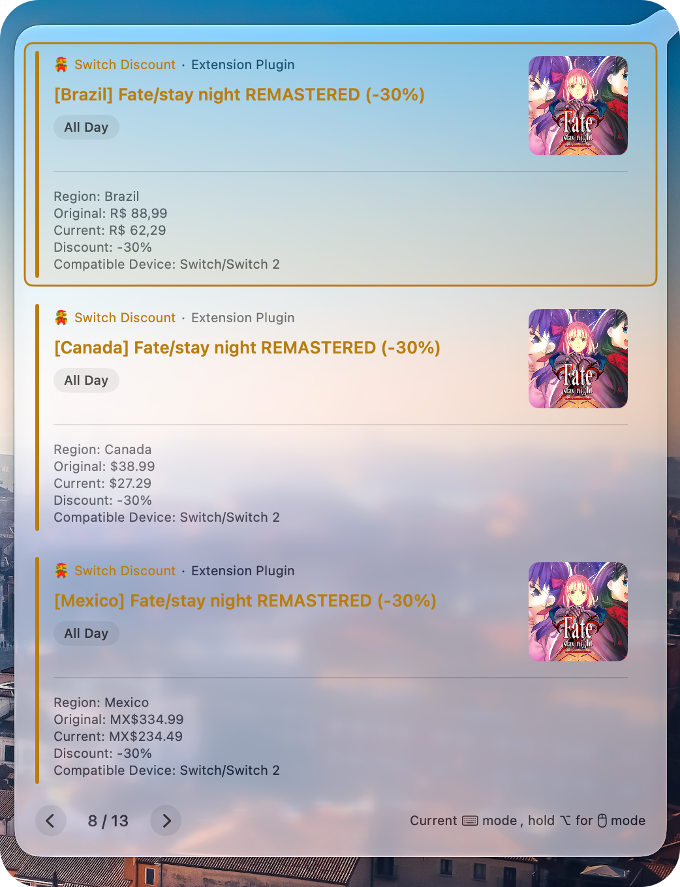

## Nintendo Switch Multi-Region Discount Tracker



Monitor Nintendo Switch eShop discounts for a custom list of games across multiple regions. When a watched game goes on sale, the plugin adds a timeline event with pricing details and a link to that region's store page.

### Features

- **Multi-region monitoring**: Check up to nine eShop regions in one plugin
- **Per-region events**: Each discounted region creates its own timeline entry (e.g. `[Brazil] Game Name (-30%)` and `[United States] Game Name (-30%)`)
- **Sale-only alerts**: Full-price games do not generate events
- **Pricing details**: Original price, current price, and discount percentage in local currency
- **Store metadata**: Game title, cover image, device compatibility, and store link fetched automatically
- **Color coding**: Event color reflects discount depth (75%+ red, 50%+ orange, 25%+ yellow, below 25% blue)
- **Daily cache**: Results are cached for 2 hours to reduce API requests

### Configuration

| Parameter | Type | Required | Description |
|-----------|------|----------|-------------|
| `game_ids` | string | Yes | Comma-separated NSUIDs of games to watch. Maximum **20** games. Prefix letters (e.g. `D`) are removed automatically. |
| `regions` | string | No | Comma-separated region codes to monitor. Use the codes below — you do not need to memorize them. Defaults to all listed regions if omitted. |

#### `regions` — code reference

Enter the **Code** values below, separated by commas. Each code maps to one Nintendo eShop region:

| Code | Country / Region | eShop |
|------|------------------|-------|
| `JP` | Japan | store-jp.nintendo.com |
| `US` | United States | nintendo.com |
| `CA` | Canada | nintendo.com |
| `MX` | Mexico | nintendo.com |
| `BR` | Brazil | nintendo.com |
| `GB` | United Kingdom | nintendo.com |
| `DE` | Germany | nintendo.com |
| `FR` | France | nintendo.com |
| `AU` | Australia | nintendo.com |

**Example configuration**

```
game_ids: 70010000077806,70010000020840,70010000065090
regions:  US,BR,JP
```

The example above monitors the United States (`US`), Brazil (`BR`), and Japan (`JP`).

### How to Find a Game NSUID

NSUIDs are region-specific. Use the ID that matches the eShop you want to monitor.

#### Americas / Europe / Oceania regions (US, CA, MX, BR, GB, DE, FR, AU)

1. Open the game page on [nintendo.com](https://www.nintendo.com/store/games/)
2. Inspect the URL or page source for the numeric ID used in store links
3. Alternatively, query the price API: `https://api.ec.nintendo.com/v1/price?country=US&ids=<NSUID>&lang=en`

**Example**

```
Store URL: https://www.nintendo.com/us/store/products/fate-stay-night-remastered-switch/
NSUID:     70010000077806
```

#### Japan (JP)

1. Visit [store-jp.nintendo.com](https://store-jp.nintendo.com/search) and open the game page
2. The ID appears in the URL after `/item/software/D`

**Example**

```
Store URL: https://store-jp.nintendo.com/item/software/D70010000020841
NSUID:     70010000020841
```

#### NSUID format notes

- Valid IDs are 14-digit numbers, usually starting with `70010000`
- Prefixes like `D70010000077806` are accepted and cleaned automatically
- If a game returns `not_found` for a region, it may be unavailable there or you may need that region's NSUID

### Display Format

Each on-sale region produces one event:

```
[Region] Game Name (-Discount%)

Region: Brazil
Original: R$ 88,99
Current: R$ 62,29
Discount: -30%
Compatible Device: Switch/Switch 2
```

**Device compatibility values**

- `Switch` — Nintendo Switch only
- `Switch 2` — Nintendo Switch 2 only
- `Switch/Switch 2` — both

### Permissions

Enable the following in the plugin's advanced settings:

- **Network** — required to query Nintendo price and store APIs
- **Storage** — required for response caching

### Technical Details

- **Monitoring limit**: Up to 20 games per run
- **Cache duration**: 2 hours (key includes date and region list)
- **Price API**: `https://api.ec.nintendo.com/v1/price`
- **Only discounted titles** with successfully fetched store metadata appear on the timeline

### FAQ

**Q: Why do I see multiple events for one game?**

A: The plugin creates one event per region where the game is discounted. This makes it easy to compare prices and open the correct store page.

**Q: Why is a game missing even though it is on sale?**

A: Common causes: wrong NSUID for that region, the game is not sold in that region, store page metadata could not be fetched, or the region is not listed in `regions`.

**Q: Can I monitor Hong Kong or other Asian regions?**

A: Not in v1.0.1. Supported regions are listed above.

**Q: Does the plugin notify when a sale ends?**

A: No. Events appear only while the game is currently discounted. When the sale ends, the event disappears on the next refresh.

### Changelog

#### v1.0.1

- Multi-region release (JP, US, CA, MX, BR, GB, DE, FR, AU)
- New `regions` configuration option
- Per-region timeline events with localized store links
- Increased game limit from 10 to 20

#### v1.0.0

- **Breaking change** — replaces the Japan-only plugin with multi-region support

**What changed**

| Before (v0.1.x) | After (v1.0.x) |
|-----------------|----------------|
| Japan eShop only | Up to 9 regions via `regions` |
| Event title: `Game Name (-30%)` | Event title: `[Region] Game Name (-30%)` |
| One event per discounted game | One event per discounted game **per region** |
| Max 10 games | Max 20 games |
| Only `game_ids` config | `game_ids` + `regions` config |

**Migration**

1. If you only want Japan, set `regions` to `JP` (previously this was the only behavior).
2. Review `game_ids` — NSUIDs are region-specific; an ID that works in Japan may not work in US/BR.
3. Update any Sidefy rules that match event titles — the `[Region]` prefix is new.

#### v0.1.1

- Japan-only wishlist discount monitoring (previous version)
